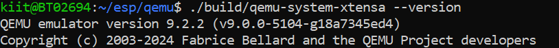

# OSHW Screening Task Report

This document presents the system configuration, setup procedure, encountered issues, and demonstration results for running ESP32 programs inside the QEMU-based emulated environment. The purpose of this setup is to verify that the virtualized ESP32 platform is suitable for automated code evaluation systems such as Yaksh, where reproducibility, determinism, and hardware independence are essential.

---

## 1. System Information

| Component | Version / Details |
|----------|-------------------|
| Operating System | Ubuntu 22.04 LTS |
| QEMU Version | Espressif fork (xtensa-softmmu target) |
| ESP-IDF Version | v5.x |
| Python Version | Python 3.x (using `venv`) |
| Key Dependencies | ninja-build, cmake, python3-venv, libslirp-dev, gcc, g++, git |

---

## 2. Setup Steps

### 2.1 Install Required Packages

```bash
sudo apt update
sudo apt install ninja-build cmake python3-venv libslirp-dev gcc g++ git
```

---

### 2.2 Build QEMU (Espressif Fork)

```bash
git clone https://github.com/espressif/qemu.git
cd qemu
git submodule update --init --recursive

./configure --target-list=xtensa-softmmu --enable-debug --enable-slirp --disable-werror
make -j$(nproc)
```

**QEMU Build Successful:**



---

### 2.3 Install ESP-IDF

```bash
git clone --recursive https://github.com/espressif/esp-idf.git
cd esp-idf
sudo apt install python3-venv
./install.sh esp32
. ./export.sh
```

**ESP-IDF Installed Successfully:**


---

### 2.4 Merge Binaries for QEMU Execution

The ESP32 boot process requires a properly structured flash image containing the bootloader, partition table, and application binary. These must be merged into a single 4 MB image file:

```bash
esptool.py --chip esp32 merge_bin --fill-flash-size 4MB \
    -o flash_image.bin @flash_args
```

---

### 2.5 Run the Application on QEMU

```bash
qemu-system-xtensa -nographic -machine esp32 \
    -drive file=flash_image.bin,if=mtd,format=raw
```

---

## 3. Challenges and Fixes

During the setup of QEMU and ESP-IDF, several issues were encountered. These have been organized by category to provide clarity and ensure reproducibility for future users attempting the same environment preparation.

---

### 3.1 Environment and Dependency Issues

**Issue: Python “externally-managed-environment” error (PEP 668)**  
- Modern Ubuntu releases restrict global `pip` installations for system stability.  
- ESP-IDF requires Python packages that cannot be installed globally under these constraints.

**Fix:**  
- Install the `python3-venv` package so that ESP-IDF can create an isolated virtual environment under `~/.espressif`.
- Re-run the installer. All dependencies then install successfully within the virtual environment.

---

**Issue: ESP-IDF compiler not detected**  
- `xtensa-esp32-elf-gcc` was unavailable because the ESP-IDF environment was not activated in the current shell.

**Fix:**  
Activate the ESP-IDF environment before building:
```bash
. ./export.sh
```

This ensures all toolchain components are added to PATH.

---

### 3.2 QEMU and Build Configuration Issues

**Issue: SLiRP networking backend missing (“network backend 'user' is not compiled”)**  
- QEMU must be configured with SLiRP networking support.  
- Missing the `libslirp-dev` package causes the networking backend to be omitted silently during configuration.

**Fix:**  
Install the dependency and reconfigure QEMU:
```bash
sudo apt install libslirp-dev
./configure --target-list=xtensa-softmmu --enable-slirp --enable-debug --disable-werror
make -j$(nproc)
```

---

**Issue: Build failures with limited diagnostic information**  
- The Ninja build system runs tasks in parallel, sometimes suppressing detailed errors.

**Fix:**  
Use verbose mode for ESP-IDF builds:
```bash
idf.py build -v
```
This reveals the full compiler and linker messages so root causes can be identified.

---

### 3.3 Runtime and Flash Image Issues

**Issue: “invalid header: 0x29207d17” during QEMU boot**  
- This occurred when the ELF file or incomplete binaries were passed directly to QEMU.  
- The ESP32 expects a specific flash memory layout, including bootloader and partition table offsets.

**Fix:**  
Merge the binaries correctly:
```bash
esptool.py --chip esp32 merge_bin --fill-flash-size 4MB -o flash_image.bin @flash_args
```

---

**Issue: Continuous boot loops**  
- Caused by missing partition tables or incorrect flash size.

**Fix:**  
Use the `--fill-flash-size 4MB` flag to ensure the final image matches the ESP32’s expected flash geometry.

---

**Issue: ESP-IDF flashing tools cannot communicate**  
- Tools such as `idf.py flash` expect a physical USB-connected ESP32 device, which does not exist in a virtual environment.

**Fix:**  
Load the merged flash image directly into QEMU:
```bash
qemu-system-xtensa -nographic -machine esp32 -drive file=flash_image.bin,if=mtd,format=raw
```

---

## 4. Demonstration Screenshots

### 4.1 LED Blink Program in QEMU


---

### 4.2 Simulated Temperature Program in QEMU


---

## 5. Reflection

The combination of ESP-IDF and the Espressif-maintained QEMU fork demonstrates that ESP32 applications can be compiled, merged, and executed in a completely virtualized environment without requiring physical hardware. This provides a deterministic, reproducible, and scalable evaluation platform for embedded systems education.

For Yaksh-based automated assessment workflows:

1. Student submissions are compiled using ESP-IDF inside a controlled build environment.
2. The bootloader, partition table, and application binaries are merged into a flash image using `esptool.py`.
3. QEMU executes the image headlessly and produces stable serial output.
4. Yaksh analyzes this output to determine the correctness of the submission.

This approach removes hardware dependencies, eliminates device-related inconsistencies, and supports large-scale automated assessment.

---

## 6. References

1. OSHW Screening Task Document.  
2. QEMU Official Documentation. *The QEMU Project*. https://www.qemu.org/docs/master/  
3. Espressif QEMU Repository. *Espressif Systems*. https://github.com/espressif/qemu  
4. ESP-IDF “Get Started” Guide. *Espressif Systems*. https://docs.espressif.com/projects/esp-idf/en/latest/esp32/get-started  
5. ESP-IDF GPIO API Reference. *Espressif Systems*. https://docs.espressif.com/projects/esp-idf/en/latest/esp32/api-reference/peripherals/gpio.html  
6. Yaksh Online Evaluation Platform. *FOSSEE IIT Bombay*. https://github.com/FOSSEE/online_test  
7. ESP-IDF Example Projects (“get-started”). *Espressif Systems*. https://github.com/espressif/esp-idf/tree/master/examples/get-started  

---
